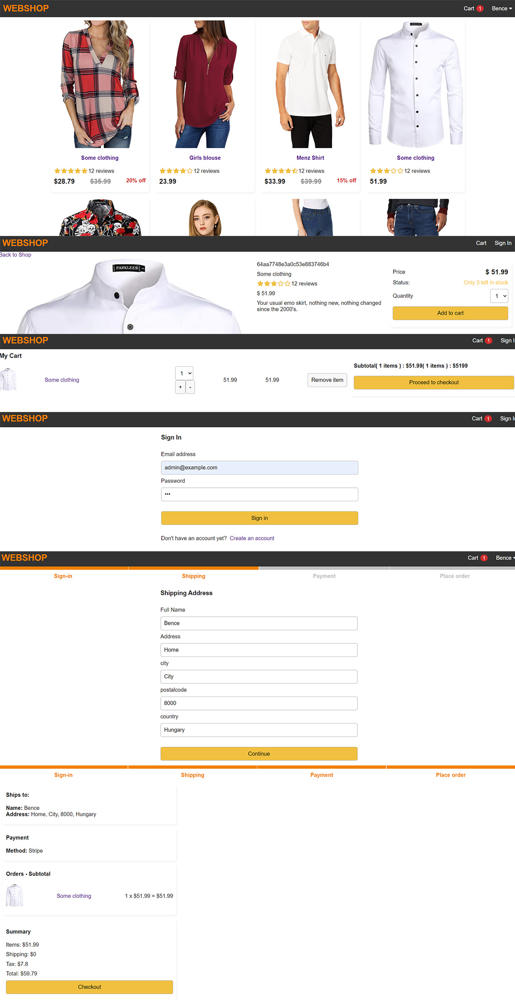

## React-Redux Webshop/Ecommerce, MERN stack.

### Technologies Used

- React: For building the user interface and managing the application's front end.
- Redux: For state management, providing a centralized store for data and simplifying data flow.
- MongoDB: As the local backend storage database.

### Getting Started

1. Clone the repository to your local machine.
2. Install Frontend and Backend dependencies using `npm install`.
3. Set up MongoDB for data storage, local or cloud.
4. seed Data.js to localhost mongodb - /api/products/seed
5. Run the applications using `npm start`.

### Features

#### Item Management

- Each item is presented with detailed information, including images, descriptions, ratings and pricing.
- Users can click on individual items to open dedicated product pages for more information.

#### Shopping Cart

- Users can add items to their shopping cart for easy tracking and eventual checkout.
- The shopping cart dynamically updates to reflect the added items, including quantity and total price.

#### User Authentication

- The application supports user registration, allowing users to create accounts.

#### Checkout Process

- Users can complete forms with shipping and billing addresses, can select from a list of payment methods during the checkout process.
- Before placing an order, users can review an order summary, including items, quantities, and total cost.

#### Data Storage

- The project utilizes MongoDB as the storage database to securely manage and store product information, user data, and order details.

